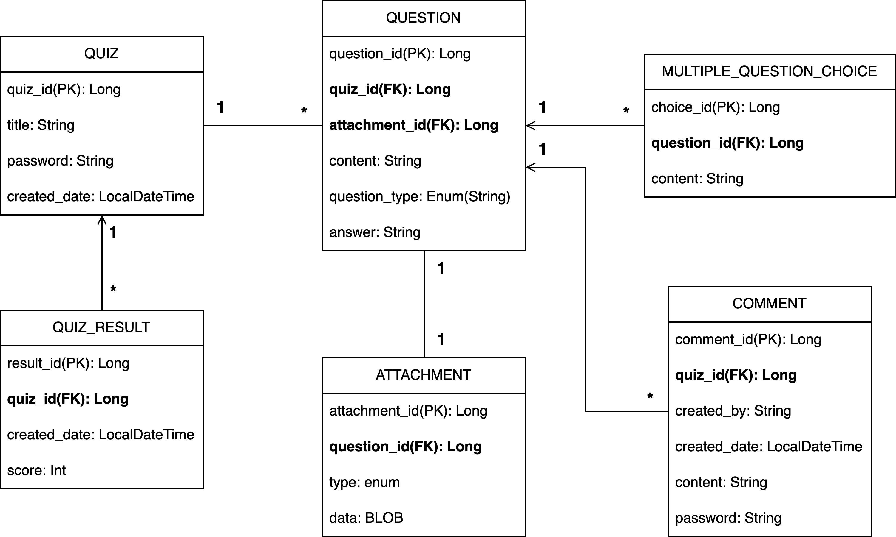

> harpseal은 누구나 퀴즈를 출제하고 풀 수 있도록 해주는 서비스입니다.

## 도메인 모델

- **QUIZ**
    > 출제된 퀴즈를 저장한 테이블
    - `quiz_id(PK)`: 퀴즈 PK
    - `title`: 퀴즈의 제목
    - `password`: 퀴즈를 등록 시 입력한 패스워드. 퀴즈를 삭제할 때 사용된다.
    - `created_date`: 퀴즈 생성 일시
- **QUESTION**
    > 퀴즈의 문제들을 저장한 테이블
    - `question_id(PK)`: 문제 PK
    - `quiz_id(FK)`: 연관된 퀴즈(QUIZ)의 ID
    - `attachment_id(FK)`: 연관된 첨부파일(ATTACHMENT)의 ID
    - `content`: 문제 내용
    - `question_type`: 문제의 타입(객관식, 주관식)
    - `answer`: 문제의 정답
- **MULTIPLE_QUESTION_CHOICE**
    > 객관식 퀴즈 문제의 선택지 정보를 담은 테이블
    - `choice_id(PK)`: 선택지 ID
    - `question_id(FK)`: 연관된 문제(QUESTION)의 ID
    - `content`: 선택지 내용
- **COMMENT**
    > 퀴즈의 댓글을 담은 테이블
    - `comment_id(PK)`: 댓글 ID
    - `quiz_id`: 연관된 퀴즈(QUIZ)의 ID
    - `created_by`: 댓글 생성자 이름
    - `created_date`: 댓글 생성 날짜
    - `password`: 댓글 등록 시 입력한 패스워드. 댓글을 삭제할 때 사용된다.
- **ATTACHMENT**
    > 문제(question)의 첨부파일을 담은 테이블
    - `attachment_id`: 첨부파일 ID
    - `question_id`: 연관된 문제(QUESTION)의 ID
    - `type`: 첨부파일 타입(`IMAGE`, `SOUND`, ...)
    - `data`: 첨부파일 바이너리 데이터
- **QUIZ_RESULT**
    > 퀴즈의 결과를 저장하는 테이블
    - `result_id(PK)`: 결과 ID
    - `quiz_id(FK)`: 연관된 퀴즈(QUIZ)의 ID
    - `created_date`: 결과 생성 날짜
    - `score`: 점수